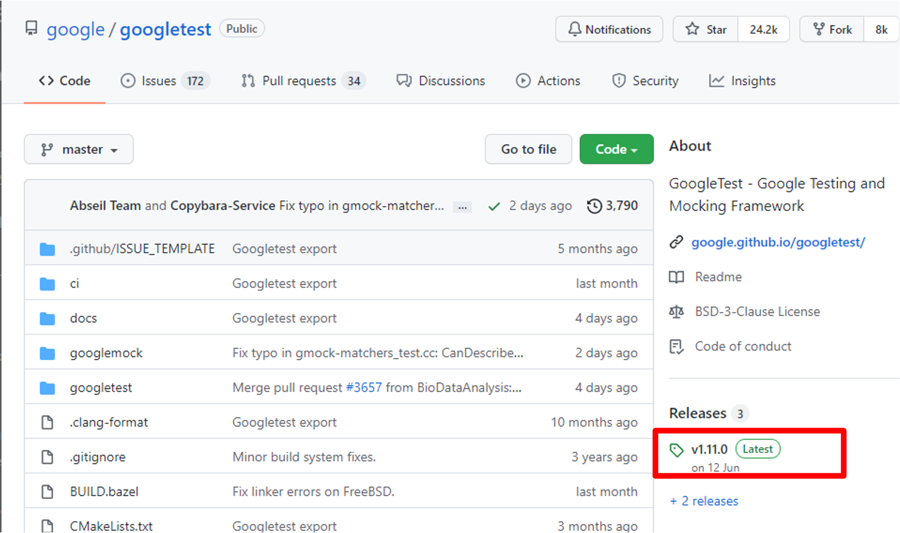
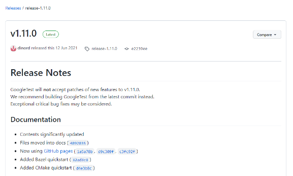

# Lecture 16: GoogleTest Tutorial

Credit: [GoogleTest from Google](https://github.com/google/googletest), [CNOCycle/cpp_tutorial by E. Chen](https://github.com/CNOCycle/cpp_tutorial)

## Installation

以下為安裝 GoogleTest 的懶人包，詳細安裝方式請參考 [Quickstart: Building with CMake](https://google.github.io/googletest/quickstart-cmake.html)

### Download GoogleTest

* 下載 [GoogleTest release v1.11.0](https://github.com/google/googletest/releases/tag/release-1.11.0)





* 解壓縮到你的 vscode 目錄下，並打開 vscode
  * 可以在 `Explorer` 內右鍵，選擇 `Reveal in File Explorer` 或 `Reveal in Finder` 來打開現在 vscode 的目錄

### Build GoogleTest

打開 vscode 的 Terminal，輸入以下指令，將 GoogleTest 安裝到你的 vscode 目錄下

#### Windows (mingw)

``` cmd
cd googletest-release-1.11.0
mkdir build
cd build
cmake -G "MinGW Makefiles" -DCMAKE_INSTALL_PREFIX="../../gtest" ..
mingw32-make -j
mingw32-make -j install
```

#### Linux & WSL

``` shell
sudo apt update
sudo apt install -y cmake
cd googletest-release-1.11.0
mkdir build
cd build
cmake -DCMAKE_INSTALL_PREFIX=../../gtest ..
make -j
make install
```

#### macOS

* Install brew first [here](https://brew.sh/)

``` shell
brew update
brew install cmake
cd googletest-release-1.11.0
mkdir build
cd build
cmake -DCMAKE_INSTALL_PREFIX=../../gtest ..
make -j
make install
```

### Configure VSCode for GoogleTest

可以直接參考以下設定，設定好之後，就可以使用 VSCode 去編譯 GoogleTest

* Windows/Linux: 
  * Compile: <kbd>Ctrl</kbd> + <kbd>Shift</kbd> + <kbd>B</kbd>
  * Debug: <kbd>F5</kbd>
* macOS:
  * Compile: <kbd>Cmd</kbd> + <kbd>Shift</kbd> + <kbd>B</kbd>
  * Debug: <kbd>F5</kbd>

#### Windows (MinGW)

`.vscode/c_cpp_properties.json`

``` json
{{#include .vscode_mingw/c_cpp_properties.json}}
```

`.vscode/launch.json`

``` json
{{#include .vscode_mingw/launch.json}}
```

`.vscode/tasks.json`

``` json
{{#include .vscode_mingw/tasks.json}}
```

#### Linux & WSL

`.vscode/c_cpp_properties.json`

``` json
{{#include .vscode_linux/c_cpp_properties.json}}
```

`.vscode/launch.json`

``` json
{{#include .vscode_linux/launch.json}}
```

`.vscode/tasks.json`

``` json
{{#include .vscode_linux/tasks.json}}
```

#### macOS

`.vscode/c_cpp_properties.json`

``` json
{{#include .vscode_mac/c_cpp_properties.json}}
```

`.vscode/launch.json`

``` json
{{#include .vscode_mac/launch.json}}
```

`.vscode/settings.json`

``` json
{{#include .vscode_mac/settings.json}}
```

`.vscode/tasks.json`

``` json
{{#include .vscode_mac/tasks.json}}
```

### Hello GoogleTest

Ref: [Quickstart: Building with CMake](https://google.github.io/googletest/quickstart-cmake.html#create-and-run-a-binary)

``` c++
#include <gtest/gtest.h>

// Demonstrate some basic assertions.
TEST(HelloTest, BasicAssertions)
{
    // Expect two strings not to be equal.
    EXPECT_STRNE("hello", "world");
    // Expect equality.
    EXPECT_EQ(7 * 6, 42);
}
```

``` console
Running main() from /Users/stevenokm/waste/projects/googletest-release-1.11.0/googletest/src/gtest_main.cc
[==========] Running 1 test from 1 test suite.
[----------] Global test environment set-up.
[----------] 1 test from HelloTest
[ RUN      ] HelloTest.BasicAssertions
[       OK ] HelloTest.BasicAssertions (0 ms)
[----------] 1 test from HelloTest (0 ms total)

[----------] Global test environment tear-down
[==========] 1 test from 1 test suite ran. (0 ms total)
[  PASSED  ] 1 test. 
```

### Code Structure

Ref: [Testing Reference](https://google.github.io/googletest/reference/testing.html)

#### TEST

<pre>
TEST(<em>TestSuiteName</em>, <em>TestName</em>) {
  ... <em>statements</em> ...
}
</pre>

Defines an individual test named *`TestName`* in the test suite
*`TestSuiteName`*, consisting of the given statements.

Both arguments *`TestSuiteName`* and *`TestName`* must be valid C++ identifiers
and must not contain underscores (`_`). Tests in different test suites can have
the same individual name.

The statements within the test body can be any code under test.
[Assertions](https://google.github.io/googletest/reference/assertions.html) used within the test body determine the outcome of
the test.

### Assert & Expect

GoogleTest 提供了兩個新的測試模式，Assert 和 Expect，用來檢查測試結果是否正確。

#### Assert

Assert 的意思是只要敘述結果錯誤，該測試就會立刻失敗，而不會繼續執行下去。

#### Expect

Expect 的意思是檢查敘述結果是否正確，如果不正確，該測試會失敗，但是繼續執行下去。

#### Example: different of Assert & Expect

``` c++
#include <gtest/gtest.h>

// Demonstrate some Assert assertions.
TEST(HelloTest, AssertAssertions)
{
    // Assert two strings to be equal.
    ASSERT_STREQ("hello", "world");
    // Assert non-equality.
    ASSERT_NE(7 * 6, 42);
}

// Demonstrate some Expect assertions.
TEST(HelloTest, ExpectAssertions)
{
    // Expect two strings to be equal.
    EXPECT_STREQ("hello", "world");
    // Expect non-equality.
    EXPECT_NE(7 * 6, 42);
}
```

``` console
Running main() from /Users/stevenokm/waste/projects/googletest-release-1.11.0/googletest/src/gtest_main.cc
[==========] Running 2 tests from 1 test suite.
[----------] Global test environment set-up.
[----------] 2 tests from HelloTest
[ RUN      ] HelloTest.AssertAssertions
/Users/stevenokm/waste/projects/test.cpp:7: Failure
Expected equality of these values:
  "hello"
  "world"
[  FAILED  ] HelloTest.AssertAssertions (0 ms)
[ RUN      ] HelloTest.ExpectAssertions
/Users/stevenokm/waste/projects/test.cpp:16: Failure
Expected equality of these values:
  "hello"
  "world"
/Users/stevenokm/waste/projects/test.cpp:18: Failure
Expected: (7 * 6) != (42), actual: 42 vs 42
[  FAILED  ] HelloTest.ExpectAssertions (0 ms)
[----------] 2 tests from HelloTest (0 ms total)

[----------] Global test environment tear-down
[==========] 2 tests from 1 test suite ran. (0 ms total)
[  PASSED  ] 0 tests.
[  FAILED  ] 2 tests, listed below:
[  FAILED  ] HelloTest.AssertAssertions
[  FAILED  ] HelloTest.ExpectAssertions

 2 FAILED TESTS
```

### Types of Assertions

`sample1.h`
``` c++
{{#include sample1.h}}
```

`sample1_unittest.cc`
``` c++
{{#include sample1_unittest.cc}}
```

### Example: Postfix Calculator

`lab12_3_include.h`
``` c++
{{#include lab12_3_include.h}}
```

`lab12_3_main.cpp`
``` c++
{{#include lab12_3_main.cpp}}
```

`lab12_3_unittest.cpp`
``` c++
{{#include lab12_3_unittest.cpp}}
```

``` console
Running main() from /Users/stevenokm/waste/projects/googletest-release-1.11.0/googletest/src/gtest_main.cc
[==========] Running 23 tests from 3 test suites.
[----------] Global test environment set-up.
[----------] 5 tests from ParseExpression
[ RUN      ] ParseExpression.Operands
[       OK ] ParseExpression.Operands (0 ms)
[ RUN      ] ParseExpression.Operators
[       OK ] ParseExpression.Operators (0 ms)
[ RUN      ] ParseExpression.Mixed1
[       OK ] ParseExpression.Mixed1 (0 ms)
[ RUN      ] ParseExpression.Mixed2
[       OK ] ParseExpression.Mixed2 (0 ms)
[ RUN      ] ParseExpression.Mixed3
[       OK ] ParseExpression.Mixed3 (0 ms)
[----------] 5 tests from ParseExpression (0 ms total)

[----------] 12 tests from CheckPostfixExpression
[ RUN      ] CheckPostfixExpression.Operand
[       OK ] CheckPostfixExpression.Operand (0 ms)
[ RUN      ] CheckPostfixExpression.Operator
[       OK ] CheckPostfixExpression.Operator (0 ms)
[ RUN      ] CheckPostfixExpression.Mixed
[       OK ] CheckPostfixExpression.Mixed (0 ms)
[ RUN      ] CheckPostfixExpression.SimpleExpression
[       OK ] CheckPostfixExpression.SimpleExpression (0 ms)
[ RUN      ] CheckPostfixExpression.ComplexExpression1
[       OK ] CheckPostfixExpression.ComplexExpression1 (0 ms)
[ RUN      ] CheckPostfixExpression.ComplexExpression2
[       OK ] CheckPostfixExpression.ComplexExpression2 (0 ms)
[ RUN      ] CheckPostfixExpression.ComplexExpression3
[       OK ] CheckPostfixExpression.ComplexExpression3 (0 ms)
[ RUN      ] CheckPostfixExpression.ComplexExpression4
[       OK ] CheckPostfixExpression.ComplexExpression4 (0 ms)
[ RUN      ] CheckPostfixExpression.NotExpression1
[       OK ] CheckPostfixExpression.NotExpression1 (0 ms)
[ RUN      ] CheckPostfixExpression.NotExpression2
[       OK ] CheckPostfixExpression.NotExpression2 (0 ms)
[ RUN      ] CheckPostfixExpression.NotExpression3
[       OK ] CheckPostfixExpression.NotExpression3 (0 ms)
[ RUN      ] CheckPostfixExpression.NotExpression4
[       OK ] CheckPostfixExpression.NotExpression4 (0 ms)
[----------] 12 tests from CheckPostfixExpression (0 ms total)

[----------] 6 tests from CalculateExpression
[ RUN      ] CalculateExpression.Operand
[       OK ] CalculateExpression.Operand (0 ms)
[ RUN      ] CalculateExpression.SimpleExpression
[       OK ] CalculateExpression.SimpleExpression (0 ms)
[ RUN      ] CalculateExpression.ComplexExpression1
[       OK ] CalculateExpression.ComplexExpression1 (0 ms)
[ RUN      ] CalculateExpression.ComplexExpression2
[       OK ] CalculateExpression.ComplexExpression2 (0 ms)
[ RUN      ] CalculateExpression.ComplexExpression3
[       OK ] CalculateExpression.ComplexExpression3 (0 ms)
[ RUN      ] CalculateExpression.ComplexExpression4
[       OK ] CalculateExpression.ComplexExpression4 (0 ms)
[----------] 6 tests from CalculateExpression (0 ms total)

[----------] Global test environment tear-down
[==========] 23 tests from 3 test suites ran. (0 ms total)
[  PASSED  ] 23 tests.
```