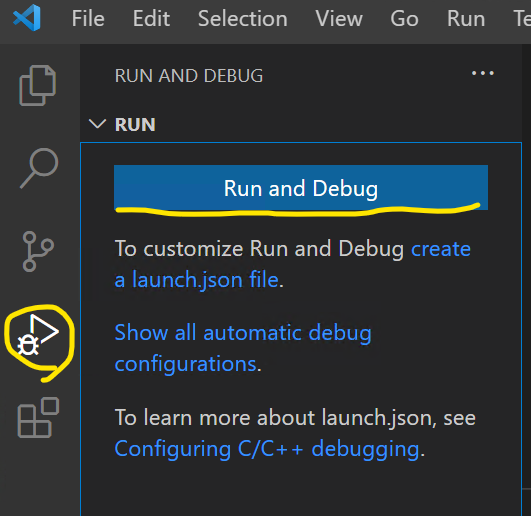

### 安裝步驟

1. 安裝 [Scoop.sh](https://www.scoop.sh/)
2. 安裝 `mingw cmake`
3. 重新開啟 VSCode

### 圖解說明

#### 安裝 [Scoop.sh](https://www.scoop.sh/)

In VSCode: `Terminal -> New Terminal`


在 VSCode Terminal 中輸入:

```powershell
Invoke-Expression (New-Object System.Net.WebClient).DownloadString('https://get.scoop.sh')
```

或簡易版指令

```powershell
iwr -useb get.scoop.sh | iex
```

**Note:** 

如果遇到錯誤 (execution policy)，可能需要使用以下指令更改執行策略後重新執行安裝指令:

```powershell
Set-ExecutionPolicy RemoteSigned -scope CurrentUser
```

如果遇到 "無法建立 SSL/TLS 的安全通道。" 問題，可能需要使用以下指令更改系統的 SSL 設定:

```powershell
[System.Net.ServicePointManager]::SecurityProtocol = "tls12, tls11"
```

如果遇到 7zip 安裝失敗，可以先安裝 7zip 再安裝 mingw，以下是指令:

```powershell
scoop install 7zip
scoop install mingw
```

#### 安裝 `mingw cmake`

在 VSCode Terminal 中輸入:

```powershell
scoop install mingw cmake
```

**Note:** 安裝完成後須重新啟動 VSCode 才能生效

### 測試編譯以及除錯

#### 測試編譯

1. 在 `%USERPROFILE%` 中新增一個資料夾，名稱可以自由取 (如 `test`)。


2. 用 `vscode` 編輯器選擇開啟新增的資料夾 (以 `test` 為例)，如下圖示範：


3. 信任開啟檔案，選擇`Yes, I trust`，如下圖示範：


4. 新增文件 `test.cpp`，如下圖示範：

In VSCode: `Exploer -> New File`

輸入 `test.cpp`


在文字輸入區輸入以下程式碼

```c++
#include <iostream>
#include <vector>
#include <string>

using namespace std;

int main()
{
    vector<string> msg {"Hello", "C++", "World", "from", "VS Code", "and the C++ extension!"};

    for (const string& word : msg)
    {
        cout << word << " ";
    }
    cout << endl;
}
```


5. 在第 9 行左側按下去，會出現紅點，如下圖示範：


6. 按下`ctrl+shift+B`按鍵，或上方`terminal -> Run Build Task`，如下圖示範：


7. 此時上方會出現以下畫面，選擇中間選項使用 **g++** 編譯檔案，如下圖示範：


8. 設置正確的話，此時下方會出現編譯成功完成的提示，如下圖示範：


#### 測試除錯

1. 完成前項`測試編譯`的所有流程

2. 按下左方三角形按鈕後選擇`Run and Debug`，如下圖示範：



3. 此時上方會依序出現相關提示，選擇預設的即可，如下圖示範：


4. 若設定正確的話，會看到程式停留在選取的第 9 行，如下圖示範：


