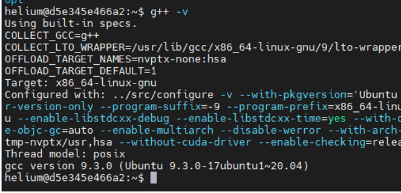
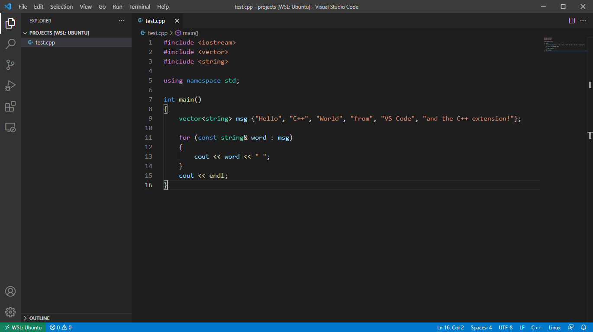
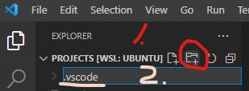
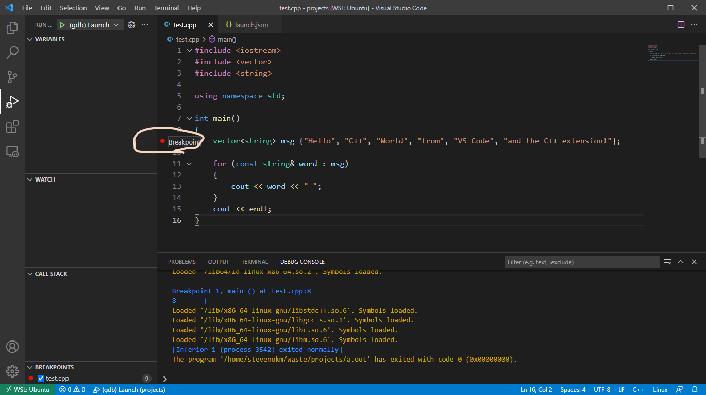
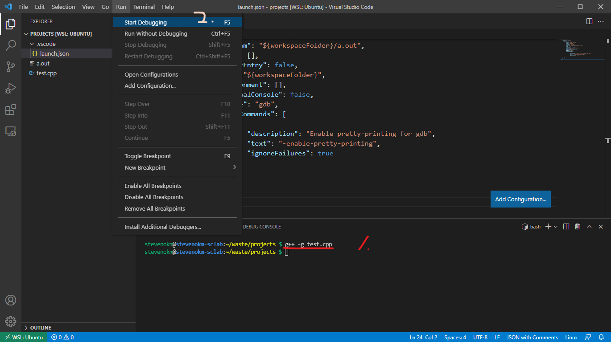

# Visual Studio Code Tutorial (WSL/windows + mingw)

## 設定 VSCode 環境 (WSL)

NOTE: 安裝教學影片 [WSL Tutorial](https://youtu.be/5HDa-unVCc4)

### 安裝 WSL & GCC

Install WSL: [https://docs.microsoft.com/en-us/windows/wsl/install](https://docs.microsoft.com/en-us/windows/wsl/install)

#### 啟動 WSL Ubuntu


在 **WSL Ubuntu** 輸入以下指令：

```bash
sudo apt update
sudo apt install -y build-essential g++ gdb
g++ -v
```

Wrong:


Correct:



### 安裝 VSCode & Remote - WSL plugin

Install VSCode: [https://code.visualstudio.com/docs/setup/windows](https://code.visualstudio.com/docs/setup/windows)

Install the Remote - WSL extension for VSCode: [https://marketplace.visualstudio.com/items?itemName=ms-vscode-remote.remote-wsl](https://marketplace.visualstudio.com/items?itemName=ms-vscode-remote.remote-wsl)

### 新增專案 (Hello world!)

重新打開 **WSL Ubuntu** 並輸入以下指令：

```console
$ mkdir projects
$ cd projects
$ code .
```

Correct:


### 安裝 WSL C++ plugin

Install the C++ extension for VSCode: [https://marketplace.visualstudio.com/items?itemName=ms-vscode.cpptools](https://marketplace.visualstudio.com/items?itemName=ms-vscode.cpptools)

Correct:


In VSCode: `Exploer -> New File`

輸入 `test.cpp`


在文字輸入區輸入以下程式碼

```c++
#include <iostream>
#include <vector>
#include <string>

using namespace std;

int main()
{
    vector<string> msg {"Hello", "C++", "World", "from", "VS Code", "and the C++ extension!"};

    for (const string& word : msg)
    {
        cout << word << " ";
    }
    cout << endl;
}
```



### 編譯 & 執行 Hello world!

In VSCode: `Terminal -> New Terminal`


In VSCode Terminal:
```console
$ g++ test.cpp
$ ./a.out
Hello C++ World from VS Code and the C++ extension! 
$ 
```

### Debugger

可以設置中斷點，方便程式除錯。

#### `launch.json`

In VSCode: `Exploer -> New Folder`

輸入 `.vscode`



In VSCode: `Exploer -> New File`

輸入 `launch.json`

在文字輸入區輸入以下設定檔

```json
{
    "version": "0.2.0",
    "configurations": [
        {
            "name": "(gdb) Launch",
            "type": "cppdbg",
            "request": "launch",
            "program": "${workspaceFolder}/a.out",
            "args": [],
            "stopAtEntry": false,
            "cwd": "${workspaceFolder}",
            "environment": [],
            "externalConsole": false,
            "MIMode": "gdb",
            "setupCommands": [
                {
                    "description": "Enable pretty-printing for gdb",
                    "text": "-enable-pretty-printing",
                    "ignoreFailures": true
                }
            ]
        }
    ]
}
```

#### 編譯 & 執行 Debugger

In VSCode Terminal:
```console
$ g++ -g test.cpp
$ 
```

插入中斷點

在要中斷的程式碼行號左邊點一下



In VSCode: `Run -> Start Debugging F5`




## 設定 VSCode 環境 (Windows + mingw)

Modified from: [CNOCycle/cpp_tutorial by E. Chen](https://github.com/CNOCycle/cpp_tutorial)

{{#include install-windows.md}}

Reference: 

* [CNOCycle/cpp_tutorial by E. Chen](https://github.com/CNOCycle/cpp_tutorial)
* [Get Started with C++ and Windows Subsystem for Linux in Visual Studio Code](https://code.visualstudio.com/docs/cpp/config-wsl)
* [Get Started with C++ and Mingw-w64 in Visual Studio Code](https://code.visualstudio.com/docs/cpp/config-mingw)
